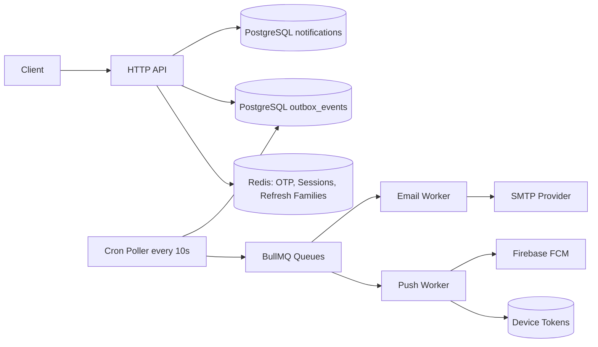

# Nest Notification System

Event-driven notification backend built with NestJS, PostgreSQL, Redis, BullMQ, and TypeORM.

This service provides:

- Authentication and session management.
- Email verification via OTP.
- Idempotent notification intake API.
- Outbox-based asynchronous delivery pipeline.
- Email and push (FCM) delivery workers.
- Device token registration for push notifications.

## Architecture Overview

The service follows a transactional outbox pattern to keep API writes and background processing consistent.



### Delivery Flow

1. Client calls notification endpoint with x-idempotency-key.
2. API creates notification and outbox event in one DB transaction.
3. Cron poller scans pending outbox rows every 10 seconds.
4. Poller enqueues BullMQ jobs by channel (email or push).
5. Workers claim and send; notification status moves through:
   pending -> queued -> in_progress -> sent or failed.

## Core Modules

- auth: registration, login, OTP verification, token refresh, logout.
- notifications: notification intake and idempotency handling.
- outbox-event: polling and queue dispatch.
- integrations/mail: SMTP + template rendering.
- integrations/push: push abstraction + FCM provider.
- devices: push token registration and invalidation.
- otp: OTP generation, attempt tracking, validation.
- sessions: session storage in Redis.
- token: JWT issuing and refresh token family lifecycle.

## Tech Stack

- Runtime: Node.js 20+, NestJS 10
- Database: PostgreSQL 16
- Cache and state: Redis
- Queue: BullMQ
- ORM: TypeORM
- Auth: JWT + Passport
- Mail templating: Handlebars via @nestjs-modules/mailer
- Push: firebase-admin (FCM)

## Prerequisites

- Node.js 20+
- npm 10+
- Docker and Docker Compose (recommended for local infra)
- PostgreSQL and Redis (if running without Docker)

## Quick Start

### Option A: Docker Compose (recommended)

```bash
docker compose up --build
```

Services started:

- API: http://localhost:3005
- Swagger: http://localhost:3005/api
- PostgreSQL: localhost:5432
- pgAdmin: http://localhost:8080
- Redis: localhost:6379
- RedisInsight: http://localhost:5540

### Option B: Local Node process

1. Start PostgreSQL and Redis.
2. Install dependencies.

```bash
npm ci
```

3. Configure .env.
4. Start app.

```bash
npm run start:dev
```

## Scripts

```bash
# app lifecycle
npm run start
npm run start:dev
npm run start:prod

# build and quality
npm run build
npm run lint
npm run format


# migrations
npm run migration:generate
npm run migration:create
npm run migration:run
npm run migration:revert
npm run migration:show
```

## API Surface

Base path:

- /api/v1

Swagger:

- /api

### Health

- GET /

### Auth

- POST /api/v1/auth/register
- POST /api/v1/auth/login
- POST /api/v1/auth/verify
- POST /api/v1/auth/resend-otp
- POST /api/v1/auth/logout
- POST /api/v1/auth/refresh-token

### Notification Intake

- POST /api/v1/notification

Headers:

- Authorization: Bearer access_token
- x-idempotency-key: UUID (required)

### Device Tokens

- POST /api/v1/devices/push-token
- DELETE /api/v1/devices/push-token

## Delivery Reliability and Idempotency

- Notification intake is idempotent by correlationId from x-idempotency-key.
- Unique conflict handling returns existing notification record.
- Worker retries are enabled with exponential backoff.
- Final failures persist error details and increment retry counters.
- Outbox records are independently tracked as pending, processed, or failed.

## Operational Notes

- BullMQ default attempts: 3.
- Outbox poll interval: every 10 seconds.
- Push worker concurrency: 5.
- Email worker concurrency: 3.
- CORS is currently open to all origins.

## Testing

The repository includes:

- A shell runner script for manual flow checks.
